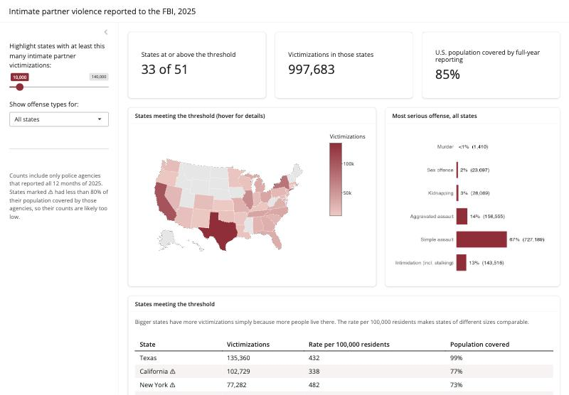

```{r setup}
library(dplyr)
library(readr)
library(ggplot2)
library(knitr)

states   <- read_csv("processed/state_summary_2025.csv", show_col_types = FALSE)
offenses <- read_csv("processed/ipv_by_state_offense_2025.csv", show_col_types = FALSE)
funnel   <- read_csv("processed/data_funnel_2025.csv", show_col_types = FALSE)

fmt_n   <- function(x) format(round(x), big.mark = ",", trim = TRUE)
fmt_pct <- function(x, d = 0) paste0(format(round(100 * x, d), nsmall = d), "%")
red <- "#9b2335"
theme_set(theme_minimal(base_size = 13) + theme(panel.grid.minor = element_blank()))

total      <- sum(states$ipv_victims)
nat_cov    <- sum(states$population_covered) / sum(states$population_total)
nat_rate   <- 1e5 * total / sum(states$population_covered)
low_cov    <- filter(states, pct_covered < 0.8) |> arrange(pct_covered)
r2         <- cor(states$ipv_victims, states$population_covered)^2
top10_overlap <- length(intersect(slice_max(states, ipv_victims, n = 10)$state,
                                  slice_max(states, rate_per_100k, n = 10)$state))
offense_mix <- offenses |> group_by(offense_type) |> summarise(n = sum(victims)) |>
  mutate(share = n / sum(n)) |> arrange(desc(n))
```

## Summary

- **Volume.** Police agencies that reported all of 2025 recorded **`r fmt_n(total)` intimate partner victimizations** in violent crimes. That's about **`r round(nat_rate)` per 100,000 residents** they serve.
- **Offense type.** **`r fmt_pct(offense_mix$share[offense_mix$offense_type == "Simple assault"])` were simple assaults**, meaning assaults without a weapon or serious injury. Aggravated assault and intimidation, which includes stalking, make up most of the rest. Murder is under 1% (`r fmt_n(offense_mix$n[offense_mix$offense_type == "Murder"])` victims).
- **Coverage.** The figures cover **`r fmt_pct(nat_cov)` of the U.S. population**. In **`r nrow(low_cov)` states** coverage is below 80%, so their counts are too low. Pennsylvania (`r fmt_pct(low_cov$pct_covered[1])`) is the clearest example.
- **Counts vs rates.** Ranking by count mostly ranks by population: covered population explains `r fmt_pct(r2)` of the differences in counts between states. Only `r top10_overlap` states are in the top 10 both by count and by rate (see [section 4](#counts-vs-rates)).

## 1. Purpose and audience

The dashboard answers one question for a non-specialist audience: **where were the most intimate partner violence crimes reported to police in 2025, and how reliable is each state's number?**

That audience led to three design choices:

1. **Show few elements.** There is one control, one map, one chart, one table, and three summary numbers.
2. **Pair every number with its coverage.** A reader who sees only a count could mistake missing reports for less violence.
3. **Show no trends.** The number of agencies reporting to the FBI changed a lot after the 2021 switch to NIBRS. With only one year of data, any "trend" would be a reporting artifact.

## 2. Data and processing

**Source.** The FBI's National Incident-Based Reporting System (NIBRS) master file for 2025, about 6 GB, downloaded from the Crime Data Explorer. It is a fixed-width text file, so each field sits at set character positions. The positions come from the FBI's record description (`data/help/NIBRS Record Description.pdf`).

**Two record types are used:**

- **Agency records** ("BH" lines). There is one per police agency, including agencies that sent no data. They give each agency's population served and how many months it reported, which is what we need to measure coverage.
- **Victim records** ("04" lines). There is one per victim per incident. They give the victim type, up to 10 offenses, and the victim's relationship to up to 10 offenders.

### What each step kept

```{r}
f <- funnel |> mutate(pct_of_prev = records / lag(records))
kable(f |> transmute(Step = step, Records = fmt_n(records),
                     `Kept from previous step` = ifelse(is.na(pct_of_prev), "", fmt_pct(pct_of_prev, 1))),
      align = "lrr")
```

```{r fig.height=3.6}
ggplot(funnel, aes(records, factor(step, levels = rev(step)))) +
  geom_col(fill = red, width = 0.65) +
  geom_text(aes(label = fmt_n(records)), hjust = -0.1, size = 3.6) +
  scale_x_continuous(expand = expansion(mult = c(0, 0.35))) +
  labs(x = NULL, y = NULL) +
  theme(axis.text.x = element_blank(), panel.grid = element_blank())
```

### Definitions

**Intimate partner** means the victim was the offender's:

| Code | Relationship |
|---|---|
| SE | Spouse |
| CS | Common-law spouse |
| XS | Ex-spouse |
| BG | Boyfriend or girlfriend |
| XR | Ex-boyfriend or ex-girlfriend |

A victim counts if **any** of their offenders had one of these relationships. NIBRS links relationships to offenders and offenses to victims, but it never links an offense to a specific offender. For a victim with several offenders, we can't be sure the partner committed the most serious offense. This is rare in IPV incidents.

**Violent crime against the person.** Each victim is counted once, under their most serious offense:

| Order | Offense type | NIBRS codes |
|---|---|---|
| 1 | Murder | 09A |
| 2 | Sex offense | 11A–11D (rape, sodomy, sexual assault with an object, criminal sexual contact) |
| 3 | Kidnapping | 100 |
| 4 | Aggravated assault | 13A |
| 5 | Simple assault | 13B |
| 6 | Intimidation (incl. stalking) | 13C |

### What was left out, and why

| Left out | Reason |
|---|---|
| Family violence (parents, children, siblings) | A different question with different services. Mixing it in would blur what "IPV" means. |
| Property crimes between partners (theft, vandalism) | Including them makes IPV mean more than most readers expect. |
| Robbery, human trafficking, negligent manslaughter, statutory rape, incest | Each is rare in IPV or doesn't fit "violence against a partner". Including them would add complexity without changing the picture. |
| Victims who are officers, businesses or the public | Relationship isn't meaningful for these victims, or isn't recorded. |
| Agencies that reported only part of the year (about 2% of IPV records) | A partial year would make an area look safer than it is. |
| Federal agencies and territories | No state to map them to. |
| Victim age, sex and race | Useful, but each would add a control. Left for a later version. |
| Trends over time | See [Purpose and audience](#purpose-and-audience). |

### Checks

- **Filter re-check.** For speed, `grep` picks out IPV victim records before R reads anything. R then re-checks that every record it received really has an intimate partner code; the script stops if not.
- **Independent cross-check.** A separate, more detailed parse of the same file (in `scripts/` in this repository) found 1,091,997 IPV victims of the same victim type, in the same states and full-year agencies. That pipeline used a broader offense list, which included robbery, human trafficking and the other offenses listed above, so a count about 1% higher is what you'd expect.
- **Known file quirks.**
  - 94 federal agency records are one character longer than the documented layout. They're excluded with the other federal agencies.
  - The FBI uses `NB` for Nebraska. It's recoded to the standard `NE`.

## 3. Reporting coverage

**Coverage** means the share of a state's population served by police agencies that reported all 12 months. Agency population figures come from the FBI file itself.

```{r fig.height=9}
d <- states |> mutate(state = reorder(state, pct_covered), low = pct_covered < 0.8)
ggplot(d, aes(pct_covered, state, fill = low)) +
  geom_col(width = 0.7) +
  geom_vline(xintercept = 0.8, linetype = "dashed", colour = "grey40") +
  scale_fill_manual(values = c(`FALSE` = "#c9c9c9", `TRUE` = red),
                    labels = c("80% or more", "Below 80% (marked ⚠ on the dashboard)"), name = NULL) +
  scale_x_continuous(labels = scales::percent, limits = c(0, 1), expand = c(0, 0)) +
  labs(x = "Share of population covered by full-year reporting agencies", y = NULL) +
  theme(legend.position = "top", axis.text.y = element_text(size = 8))
```

```{r}
kable(low_cov |> transmute(State = state_name,
                           `Population covered` = fmt_pct(pct_covered),
                           `Agencies reporting all year` = paste(agencies_reporting, "of", agencies_total)),
      caption = "States below 80% coverage")
```

The rate per 100,000 uses only the population that the reporting agencies serve as its denominator, which partly corrects for missing agencies. That correction assumes the missing agencies are similar to the reporting ones, and this isn't guaranteed: one missing large city can change a state's picture.

## 4. Counts vs rates {#counts-vs-rates}

The dashboard's slider works on **counts**, because the question it answers is "where is the volume?" Counts largely track population, though, so the table and hover text also show the **rate per 100,000**.

```{r}
top_n_by <- function(col) states |> arrange(desc({{ col }})) |> slice(1:10)
by_count <- top_n_by(ipv_victims)
by_rate  <- top_n_by(rate_per_100k)
kable(tibble(Rank = 1:10,
             `By count` = paste0(by_count$state_name, " (", fmt_n(by_count$ipv_victims), ")"),
             `By rate per 100k` = paste0(by_rate$state_name, " (", round(by_rate$rate_per_100k), ")")),
      caption = "Top 10 states, two ways")
```

```{r fig.height=5.5}
ggplot(states, aes(population_covered / 1e6, ipv_victims)) +
  geom_point(aes(colour = pct_covered < 0.8), size = 2.4) +
  ggrepel::geom_text_repel(aes(label = state), size = 2.8, min.segment.length = 0.2,
                           segment.colour = "grey70", max.overlaps = 20, seed = 1) +
  scale_colour_manual(values = c(`FALSE` = "grey45", `TRUE` = red),
                      labels = c("Coverage 80%+", "Coverage below 80%"), name = NULL) +
  scale_y_continuous(labels = scales::label_comma()) +
  labs(x = "Population covered (millions)", y = "IPV victimizations") +
  theme(legend.position = "top")
```

The points sit close to a straight line. **Population covered explains `r fmt_pct(r2)` of the difference in counts between states**, which is why counts alone shouldn't be read as "where IPV is worst". Only `r top10_overlap` of the top 10 states by count are also in the top 10 by rate.

## 5. Offense types

```{r fig.height=3.6}
ggplot(offense_mix, aes(share, reorder(offense_type, share))) +
  geom_col(fill = red, width = 0.65) +
  geom_text(aes(label = paste0(ifelse(share < 0.005, "<1%", fmt_pct(share)), " (", fmt_n(n), ")")),
            hjust = -0.1, size = 3.6) +
  scale_x_continuous(labels = scales::percent, expand = expansion(mult = c(0, 0.25))) +
  labs(x = "Share of IPV victimizations (most serious offense)", y = NULL)
```

## 6. The dashboard



| Element | What it shows | Why it's included |
|---|---|---|
| **Slider** | A minimum number of victimizations | It's the main question ("which states have the most reported IPV?"). Every element updates from it, so there is one thing to learn. |
| **Summary boxes** | States meeting the threshold, their combined victimizations, national coverage | Gives the answer in three numbers. The coverage box keeps the main caveat on screen at all times. |
| **Map** | Highlighted states shaded by count; others grey | Geography is the most natural way into state data. The hover text adds rate and coverage, so the detail is there without cluttering the map. |
| **Offense chart** (with state dropdown) | Most serious offense, for all states or one | Answers "what kind of violence is this?" It shows that most reported IPV is assault without a weapon. |
| **Table** | States meeting the threshold, with count, rate and coverage | Exact numbers for readers who need them, with ⚠ marking states below 80% coverage. |

## 7. Limitations and possible next steps

**Limitations:**

- **Reported crime only.** Much IPV is never reported to police, and reporting rates differ by place and group.
- **Recording differs between agencies.** Some agencies record the relationship as "unknown" far more often than others, which lowers their IPV counts.
- **Victimizations, not people.** One person victimized in two incidents is counted twice.
- **Coverage uses agency population figures.** It doesn't use Census estimates, and agency populations can overlap slightly.

**Possible next steps, in rough order of value:**

1. Add a **second year** and show change *only for agencies that reported fully in both years*. That avoids trends that come from reporting changes.
2. Use **Census state populations** as the coverage denominator.
3. Add a victim **sex or age** view.
4. Add a toggle for **family violence**.
